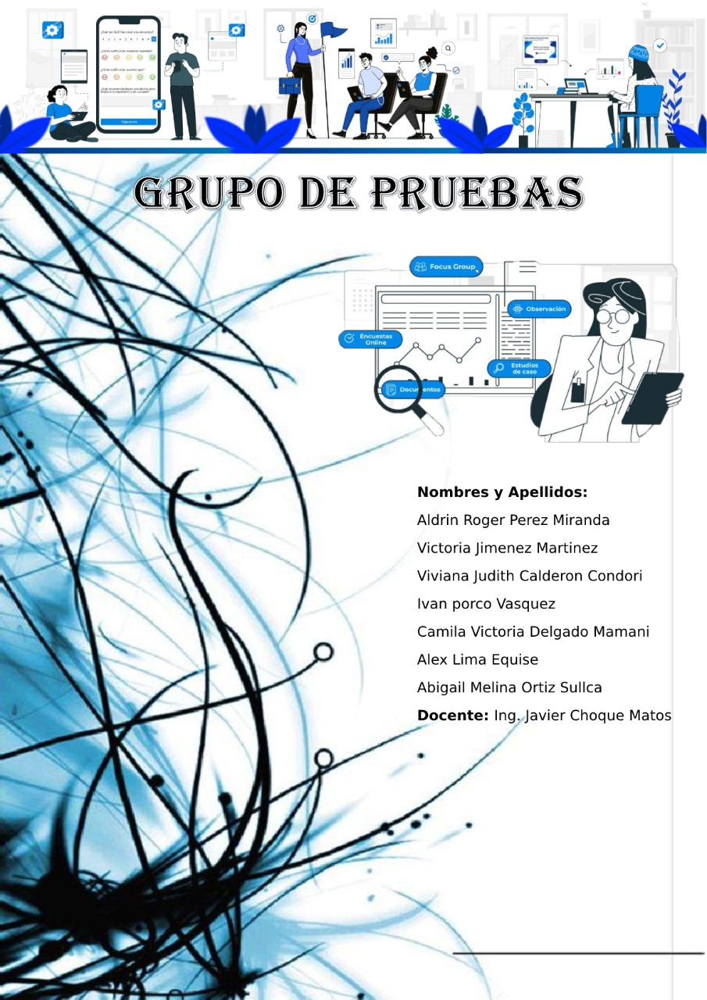
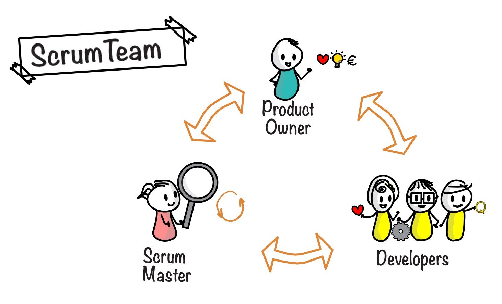
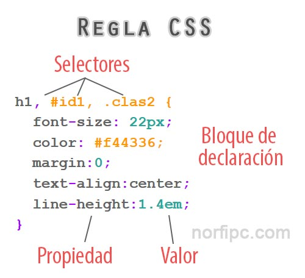
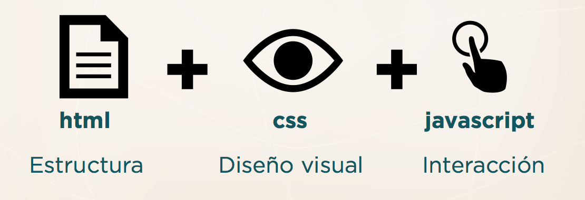
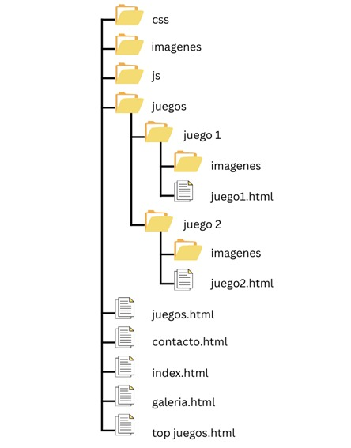

***
# **Descripción de la página o plataforma**
Esta página trata sobre el tema de los juegos (retro) que ya son olvidados y no son tan jugados, básicamente trata de revivir las experiencias que teníamos antes y poder llegar a esa fecha de 1980-1990, por ejemplo, entre estos juegos se tiene los: viborita, bomberman, buble, luigi mansión, pac-man, serpientes y escaleras.
Entre estos juegos las personas podrán elegir cual poder jugar a su elección, y a esto habrá un top de juegos que se irá actualizando constantemente al juego más jugado.
Estos juegos se compraban para las consolas y los sistemas que ya no son usados y fueron olvidados, ahora los podemos encontrar en emuladores, celulares, tabletas, etc.
En la base de datos se tiene 1631 juegos diferentes de los años ochenta y noventa. Entre estos juegos se puede decir que se tiene 372 que se puedan jugar o están disponibles en dos o más versiones.
La página tiene enlaces que te llevan a la descripción de juegos a la galería a los contactos y tiene el enlace de la página principal.
Esta página tiene una descripción más extensa de la página sobre los juegos y también su funcionamiento, luego tiene un top de juegos más jugados y también se tiene la información de los que crearon la página, galería, bonus diarios y soporte virtual.

***
# **Metodolgía**
El Proyecto, en el cual se basó, consiste en la utilización de la metodología ágil Scrum.
Metodología ágil scrum Se centra en equipos pequeños en este caso 
Tenemos 3 grupos: grupo HTML, grupo CSS y Pruebas cada grupo conformado por 10 personas como máximo el grupo Pruebas que está conformado por 7 personas, que se reúnen continuamente durante periodos cortos y trabajan en Sprint iterativos (lo recomendable del periodo de tiempo son 2 semanas).
El grupo HTML se encarga de realizar todo lo referente a HTML, en otras palabras, la estructura o esqueleto de la página. El grupo CSS se encarga de realizar todo lo referente a CSS, se encarga de darle animación a la página. El Grupo Pruebas se encarga de las revisiones y documentación del proyecto, de que la pagina que se realizo sea funcional. Cada equipo asume tareas (conocidas también como historias de usuario) como sientan que pueden realizar. Cuando el sprint termine, el software debe estar entregable y funcionando. La duración del sprint se determina antes de que comience el proceso y rara vez debería cambiar.
La implementación ágil se realiza de una forma incremental o por fases. El principal compromiso de la implementación de la metodología ágil es evitar los obstáculos y problemas. La metodología ágil se basa en la simplicidad, en entregar las funcionalidades lo más rápido posible, empezando por los componentes más importantes de. La implementación ágil que consiste en:
*	El maestro Scrum debe tener una reunión diaria de stand-up con el equipo a una hora fija todos los días durante no más de 15 minutos.
*	El objetivo es repasar tareas importantes que se han terminado, están en curso o están a punto de comenzar.
*	Realización de los requisitos, de pruebas y documentación.
*	Reuniones diarias del estado del proyecto. En esta fase se registra el estado del proyecto y se discuten los diversos obstáculos que el equipo ha podido encontrar. 
*	Sesión de prueba del Sprint. Durante esta fase los usuarios y el equipo determinan si los procesos cumplen los requisitos. 
*	Se llevará a cabo una revisión del Sprint para comprobar que se puede mejorar en los futuros Sprint.

### **Conclusión**
SCRUM propone una metodología donde se debe trabajar en equipo, debe avanzar de manera conjunta. De nada sirve tener partes de un software terminada, si no tenemos el software entero terminado.
La filosofía SCRUM resalta e impulsa el trabajo en equipo, el aprendizaje constante y una estructura que es flexible a los cambios que van sucediendo en la fase de desarrollo.

***
# **Herramientas**
 Las herramientas que se utilizaron en el desarrollo de la plataforma o pagina web:
* HTML
* CSS
### **HTML**
Como primera herramienta que se utilizo sobre todo en el equipo de estructura es el HTML ,lo cual no es un lenguaje de programación es un lenguaje demarcado que define la estructura del contenido HTML consiste en una serie de elementos que usaremos para encerar diferentes partes del contenido para que se vea de una determinada manera que se utilizaran etiquetas de encierre nos proporcionaran una imagen o una palabra como tambien un hipervinculo a otro sitio. 

### **CSS**
Como segunda heramienta se utilizo el CSS sobre todo en el equipo de diseño lo cual  son las siglas en inglés para «hojas de estilo en cascada» (Cascading Style Sheets). Básicamente, es un lenguaje que maneja el diseño y presentación de las páginas web, es decir, cómo lucen cuando un usuario las visita. Funciona junto con el lenguaje HTML que se encarga del contenido básico de las páginas. 

***
# **Estructura de las carpetas**
En este proyecto utilizaremos la siguiente estructura de carpetas y archivos para facilitar la edición y mantenimiento de la página, pero también minimizamos las posibilidades de cometer errores. 

## **CSS**:
 En esta carpeta se almacenera las hojas de estilo. Las hojas de estilo se encargarán de dar estilo y forma a distintos elementos o contenedores mediante la manipulación de sus propiedades y características. 
Para la aplicación correcta de los estilos a cada elemento o contenedor se le asignó una clase a cada uno.
Estas clases nos permitirán asignar una serie de propiedades a un contenedor o conjunto de elementos sin que exista repetición innecesaria.
### **Imagenes**:
 Esta carpeta contiene las imágenes principales de la página como ser:
*	Imagen del logo de la página.
*	Imágenes de las redes sociales de la pagina
*	Imagen de soporte virtual.
*	Imagen de bonus diarios para los diferentes juegos.
*	Imágenes de los juegos más populares.
### **JS**:
 Esta carpeta esta asignada para guardar código JavaScript que se ira implementando en las próximas actualizaciones de la página.
##### **Juegos**: 
Esta carpeta almacenara carpetas propias de cada juego. 
* **Juego1**: A esta carpeta se le asignó el nombre del juego que se añadirá a la página, esta carpeta a su vez almacenara otra carpeta de imágenes y el archivo HTML del juego:
* a)	**Imagenes (Juego)**:
 Esta carpeta almacena imágenes que son propias del juego con el que se está trabajando.
Pero también almacena imágenes de otros juegos que le pueden interesar al usuario.
Y se mantendrán las imágenes del logo, redes sociales y soporte.
* b)	**Juego1.html**:
 Este archivo almacena la estructura HTML de cada juego: 
 •	En esta estructura podremos encontrar un body en el cual podremos encontrar:
 div class=”cabeza”, el cual almacena un div class=”logo” que a la vez incluye un link en una imagen que nos llevara a la página principal, También tenemos un nav class=”navegador” que es  el menú de la página que incluirá links a las siguientes páginas: Principal, Juegos, Instrucciones, Lista de Juegos, Contactos. header class=”encabezado”, el cual almacena un h1 con el titulo del juego, un link en una imagen que nos llevara al juego.
 - section class=”contenedor-juegos”, en esta parte de añadió un h2 class=”titulos” con el titulo OTROS JUEGOS, un párrafo y un div class=”contenedor-caja” que a su vez almacena un div class=”caja” este div almacena un h3 con el titulo del juego, un link en una imagen que nos llevara al juego.
Repetiremos en div class=”caja” para los otros juegos que le pueden interesar al usuario.
- section class=”contenedor”, esta sección almacena un div que a la vez almacena un h2 class=”instrucciones” con el titulo Instrucciones del Juego y un párrafo con las instrucciones de cada juego.
##### footer en el cual encontramos: 
- Una section class=”extensiones”, la cual almacena un div class=”galeria” este contiene una imagen, un h3 con el titulo galeria y un párrafo de lo que podemos encontrar en galeria.
- Un div class=”bonus” este contiene una imagen, un h3 con el titulo Bonus diarios y un párrafo de lo que podemos encontrar en bonus.
- Un div class=”soporte” este contiene una imagen, un h3 con el titulo Soporte Virtual y un párrafo de lo que podemos encontrar en soporte.
- Una section class=”contenedor-social” la cual almacena article class=”contenedor” este almacenara un link que a la vez almacenara una img class=”redes-sociales” que nos llevara a la página de Facebook.
Repetiremos esto para la pagina de Twitter y WhatsApp. 
- Una section class=”contenedor-contacto”, la cual almacena un a (link) class=”boton” que a la vez contiene un titulo h3 con el titulo contacto y un párrafo con un número de contacto.

Esta carpeta juegos almacena una carpeta por cada juego que se añade a la página incluyendo la carpeta de imágenes y el archivo HTML el cual explicamos anteriormente.  

### **Index.html**: 
En este archivo almacena la estructura de la página principal:
•	Body en el cual podremos encontrar:
- div class=”cabeza”, el cual almacena un div class=”logo” el cual incluye un link en una imagen que nos lleva a la página principal, también almacena un nav class=”navegador” que es el menú de la página que incluirá links a las siguientes páginas: Principal, Juegos, Top Juegos, Galería, Contactos.
- header class=”encabezado”, el cual almacena una imagen principal de la página, un h1 con el titulo Juegos Retro y un h3 con el texto de bienvenida a la pagina y el objetivo de la misma.
- section class=”contenedor”, en el cual podremos encontrar informaciones sobres el top juegos, los cuales están almacenados en un div class=”caja”.
Cada div contiene el título del juego, una imagen y una pequeña descripción del juego.
- section class=”contenedor-juegos”, en esta parte de añadió un párrafo sobre que juegos podemos encontrar en la página.
- footer en el cual encontramos: 
- Una section class=”extensiones”, la cual almacena un div class=”galeria” este contiene una imagen, un h3 con el titulo galeria y un párrafo de lo que podemos encontrar en galeria.
- Un div class=”bonus” este contiene una imagen, un h3 con el titulo Bonus diarios y un párrafo de lo que podemos encontrar en bonus.
- Un div class=”soporte” este contiene una imagen, un h3 con el titulo Soporte Virtual y un párrafo de lo que podemos encontrar en soporte.
- Una section class=”contenedor-social” la cual almacena article class=”contenedor” este almacenara un link que a la vez almacenara una img class=”redes-sociales” que nos llevara a la página de Facebook.
Repetiremos esto para la pagina de Twitter y WhatsApp. 
- Una section class=”contenedor-contacto”, la cual almacena un a (link) class=”boton” que a la vez contiene un titulo h3 con el titulo contacto y un párrafo con un número de contacto.
### **Juegos.html**:
 En este archivo tendremos una estructura similar a la página principal con algunas excepciones.
•	Body en el cual podremos encontrar:
- div class=”cabeza”, el cual almacena el logo de la página el cual también será un link hacia la página principal, el menú nav class=”navegador” de la página que tendrá una opción Salir este link nos llevara a la página principal.
- section class=”contenedor-juegos”, en esta parte de añadió un título h1 class=”titulos” párrafo sobre que juegos podemos encontrar en la página.
En esta parte también encontraremos un div class=”contenedor-caja”, el cual contendrá otro div class=”caja” en el que se añadió un h2 con el nombre del juego, una imagen que contendrá un link que nos dirigirá al juego.
Repetiremos el div class=”caja” con toda la información para cada juego. 
- footer en el cual encontramos: 
- Una section class=”extensiones”, la cual almacena un div class=”galeria” este contiene una imagen, un h3 con el titulo galeria y un párrafo de lo que podemos encontrar en galeria.
- Un div class=”bonus” este contiene una imagen, un h3 con el titulo Bonus diarios y un párrafo de lo que podemos encontrar en bonus.
- Un div class=”soporte” este contiene una imagen, un h3 con el titulo Soporte Virtual y un párrafo de lo que podemos encontrar en soporte.
- Una section class=”contenedor-social” la cual almacena article class=”contenedor” este almacenara un link que a la vez almacenara una img class=”redes-sociales” que nos llevara a la página de Facebook.
Repetiremos esto para la pagina de Twitter y WhatsApp. 
- Una section class=”contenedor-contacto”, la cual almacena un a (link) class=”boton” que a la vez contiene un titulo h3 con el titulo contacto y un párrafo con un número de contacto.
### **Contacto.html**: 
En este archivo incluye un body, el cual almacena un h1 con el titulo Contáctate.
Un section que almacena un div este a la vez almacena un h2 con el titulo Envíanos un mensaje y un form que almacenara un label e input para el nombre completo y correo electrónico, también incluirá un textarea y button Enviar.
### **Galeria.html**:
 Este archivo almacenara las imágenes más destacadas de los juegos.
### **Top juegos.html**:
 Este archivo almacenara el top de juegos que se ira actualizando constantemente. 

***
